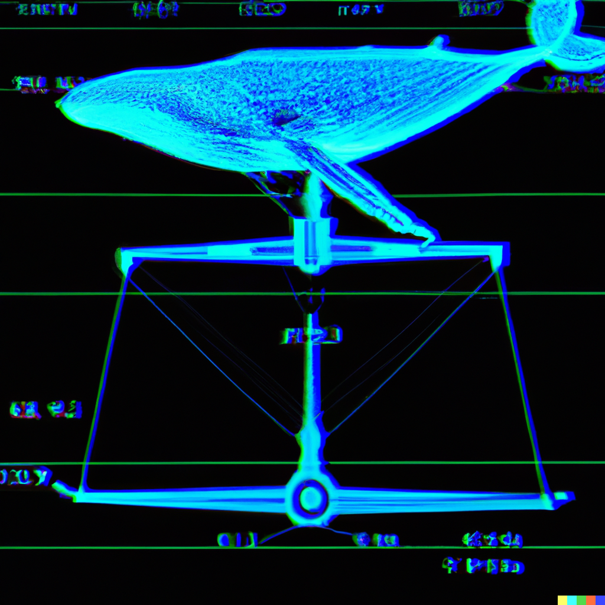

# whalescale
(C) 2023 Ashpool / gelato.sh

## About
An adaptation of Google's PageRank algorithm for determining wallet prestige and importance within a cryptocurrency financial network.

## Contact
To discuss this research please contact:

email: [ashpoolin@protonmail.com](mailto:ashpoolin@protonmail.com)

twitter: [solanobahn](https://twitter.com/solanobahn)

github: [github.com/ashpoolin](https://github.com/ashpoolin/)

web: [gelato.sh](https://www.gelato.sh/)

## Support
On-chain research is not particularly lucrative, and data + hardware is expensive. If this work has been helpful to you, please consider giving me a tip:
* Solana: 4EiLmcLNYYYQq9H2B1ESDDf8WwMKeCcp5heDgrp8SL2w
* Ethereum: 0xb397d6Af4CB79c9a845d90222f9fd887E38beaC4

Thank you for reading, and your support!