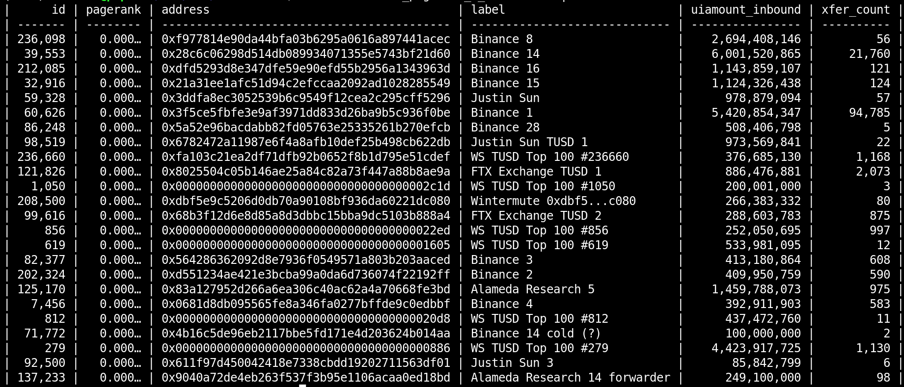
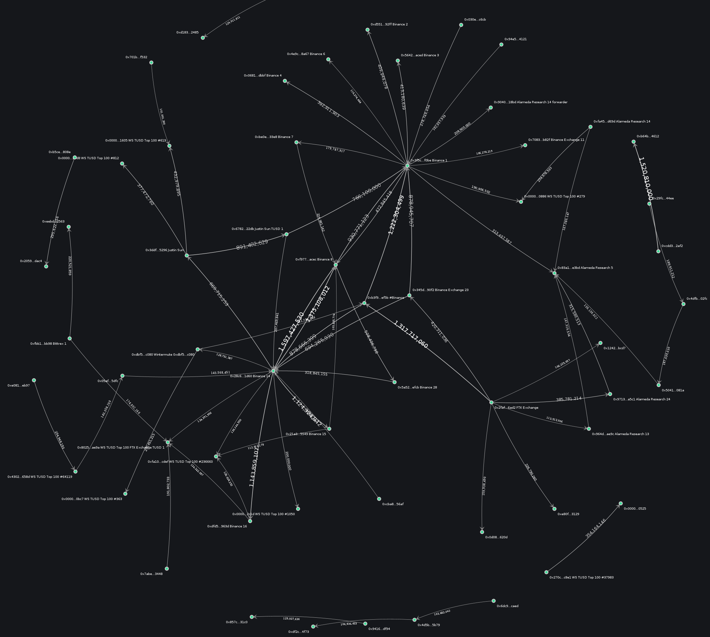

# WhaleScale
An adaptation of Google's page rank algorithm for determining wallet prestige and importance within a cryptocurrency financial network.

[gelato.sh](https://gelato.sh) / 2023-08-20 / v0.1.0

### Abstract
The WhaleScale algorithm is an adaptation of Google's PageRank algorithm that analyzes a network of cryptocurrency wallets and the amounts of currency transferred between them to determine the significance of each wallet in the network. In contrast to Google's PageRank algorithm, which treats web pages as nodes and the links between them as edges, the WhaleScale algorithm considers each wallet as a node and the combined transfer amounts as the edges between them. The WhaleScale algorithm computes the rank of each wallet based on the number and amount of cryptocurrency transfers between wallets. Wallets that have a high amount or frequency of transfers are considered more important and have a higher rank in the network. WhaleScale provides valuable insights into the cryptocurrency market by highlighting the importance of individual wallets and their role in the overall financial network. This information can be used to track capital flows, forecast market trends, and identify potential cases of market manipulation or fraudulent activities. 

This paper applies the WhaleScale (PageRank) algorithm to the history of the TUSD ERC-20 token on the Ethereum blockchain, in order to identify the top ranked wallets within that network. The paper demostrates the algorithm's efficacy in identifying the most critical nodes, by comparing the resultant top WhaleScale ranked addresses, to a network graph showing the source-destination address pairs with the largest total transfer amounts (edges). Overall, the WhaleScale algorithm offers a powerful toolset for analyzing and understanding the cryptocurrency market, allowing investors and analysts to gain deeper insights into the market's dynamics and trends.    

## Introduction
Crypto address whale or "rich lists" already exist. In many instances, you can go to a chain's block explorer, select a token, and quickly get a descending list of the top holders. While these lists are informative, they often miss the important nodes, and the paths coins followed to get where they are. Some wallets (including deposit addresses), are merely forwarding accounts, which do not maintain large, steady balances. As vital pieces in the chain of crypto flows, these addresses are overlooked by merely looking at wallet balances. An alternative is to look at total flows through a wallet over a given historical period, and sort by volume (high to low), which is quite effective. But what this method lacks is a means of weighting the importance of other nodes that are connected to it (thereby increasing its own importance), and using those weights to drive the overall ranking of nodes in a network.

A quantitative metric is proposed, the *WhaleScale* for determining the relative importance of nodes for a given cryptocurrency. The method can be applied to native tokens (bitcoin, ether, solana), contract-based tokens (ERC-20, SPL; including stablecoins like USDT, USDC), or even currencies (USD, GBP, JPY). The algorithm is based on Google's PageRank, which is well known for cleverness and value in identifying the most important nodes (in this case, webpages). The WhaleScale algorithm finds both the obvious and hidden levers that may drive cryptocurrency prices, influence consensus in proof of stake (PoS) networks, or even link malicious or fraudulent actors.

### PageRank
Google's PageRank algorithm involves analyzing the network of links between web pages to determine the importance of each page. This algorithm treats the web pages as nodes in a directed graph, where the links between pages are the edges. The algorithm assigns each page a rank based on the number and importance of pages that link to it. The basic idea is that a page is considered important if other important pages link to it, and this importance is propagated through the link structure of the web. As a result, web pages that are linked to by many other important pages tend to receive higher PageRank scores, and are therefore ranked higher in search engine results. The PageRank algorithm is so effective because it takes into account the interconnectedness of the web, allowing it to provide more relevant search results based on the overall structure of the web rather than just keyword matching.

### Prestige 
*Prestige* is a term from network theory that is used to determine the significance of a node within a network. The idea comes from a field known as "Link Analysis," which is concerned with identifying critical nodes within a system. Whereas *centrality* ranks nodes highly for their connectedness, prestige prioritizes inbound traffic as a means of determining rank. A node's prestige is shared with its outbound nodes, proportional to the number of connections it has. Practically speaking, in a financial network, you would expect to rank a node more highly if it is the recipient of high value inbound transactions. PageRank is an example of a prestige-estimating algorithm. For this reason, applying the PageRank method to financial networks helps us identify the vectors of highest value, with ease. 

### WhaleScale
The WhaleScale algorithm is a variation of Google's PageRank algorithm that analyzes the network of cryptocurrency wallets and the transaction amounts between them to determine the significance of each wallet. The algorithm treats each wallet as a node in the graph, with directed edges as links between two nodes. The algorithm assigns each wallet a rank based on the number and total amounts of transactions flowing into and out of that wallet. The basic idea of WhaleScale is that wallets with a large number of transactions or a significant amount of currency flowing through them are more important to the network and therefore have a higher rank. This ranking is propagated through the network based on the transaction amounts and the connectivity of the wallets. WhaleScale provides insights into the cryptocurrency network, allowing users to identify the most important wallets, which can be useful for tracking capital flows, forecasting cryptocurrency market trends, and identifying potential sources of market manipulation or fraud. Overall, the WhaleScale algorithm provides a powerful tool for analyzing and understanding the cryptocurrency market, highlighting the importance of individual wallets and their role in the overall network. 

## Idea in Practice

### TrueUSD
We demonstrate the use and efficacy of the WhaleScale algorithm in identifying notable addresses related to a specific stablecoin [TrueUSD (TUSD)](https://www.coingecko.com/en/coins/true-usd). This coin recently experienced a 50% surge in market cap, which was coincident with the crypto markets recovering significant ground, despite its relatively low size and usage. The relatively low number of transactions makes TUSD a useful example, although the method should be transferrable to any ERC-20, ether, or another major cryptocurrency, for that matter.

### Hardware Selection
For this project, we anticipated we needed a decent amount of processing power, RAM, and storage. All data processing occurs directly on the node, so there's some overhead needed to accommodate the additional load. The node has been constructed purely from off-the-shelf gaming PC hardware. So far, this configuration has worked for us:
```
- AMD Ryzen 5800X CPU
- 64GB of G.Skill 3600 MHz CL19 RAM
- 5x 2TB Samsung 980 Pro NVMe TLC SSDs (1x for OS and 4x configured as 
    single 8TB RAID0 for chaindata, intermediate files, and databases)
- MSi MEG X570S UNIFY-X MAX motherboard (needed for RAID0 and NVMe slots)
- Nvidia RTX 2070 GPU (for processing tensors using Torch)
```


### Data Source
An ethereum non-validating archival RPC node has been configured as the source of data. The ethereum blockchain is chosen over other networks due its relevance in the number of ERC-20 tokens that exist on it, their market capitalization and importance to the overall ecosystem, and other, more practical matters:
```
1. Address reuse is common (account model versus UTXO-based),
2. Size: the entire blockchain is contained in about 2TB of storage.
```
The RPC node uses the [RETH execution client](https://github.com/paradigmxyz/reth/), and a non-validating [Lighthouse consensus client](https://github.com/sigp/lighthouse). For general block processing, the system uses Paradigm's [Cryo command line tool](https://github.com/paradigmxyz/cryo). The data is managed through a rats nest of Unix shell scripts, and Postgres databases. Finally, the algorithm is executed using the GPU-accelerated matrix operations of the Torch libraries. 

### Procedure (General)
We begin by targeting ERC-20 transfers for the token (ERC-20 contract) of our choice. There is significant processing required prior to being able to run the algorithm. The general ritual follows:
```
1. Sync ethereum RPC node
2. Extract all block data using Cryo
3. Extract relevant contract interactions (transfers) from the Cryo data set
4. Parse transactions
5. Sum all selected token transfers between unique source-destination 
   (from_address & to_address) pairs
6. Index each address with an integer ID
7. Load source ID, destination ID, transaction count OR 
   transfer amounts into a square, sparse matrix in Torch
8. Run the algorithm
9. Reconcile WhaleScale resultant vector indices with ethereum addresses, 
   and attach labels for ease in address identification.
```
The subsequent sections will walk through each of these actions in greater detail.

#### 1. Sync Ethereum Node
This won't really be covered. The [RETH book](https://paradigmxyz.github.io/reth/) does a great job of getting you up and running. There's nothing special here, but if you are searching, here are the launching and configuration options that worked for us:
```bash
RUST_LOG=info reth node \
    --datadir /mnt/md0/ethereum \
    --chain mainnet \
    --authrpc.jwtsecret /path/to/secrets/jwt.hex \
    --authrpc.addr 127.0.0.1 \
    --authrpc.port 8551 \
    --http \
    --http.api all \
    --http.corsdomain http://127.0.0.1 \
    --log.directory /mnt/md0/ethereum/logs
``` 
Next, we concurrently launch a Lighthouse consensus client:
```bash
RUST_LOG=info lighthouse bn   
    --network mainnet \
    --execution-endpoint http://localhost:8551 \
    --execution-jwt /path/to/secrets/jwt.hex \
    --checkpoint-sync-url https://mainnet.checkpoint.sigp.io \
    --http \
    --disable-deposit-contract-sync
```

#### 2. Extract Block Data with Cryo
While you can certainly batch this process, or use individual calls to the RPC's eth API to get blocks, we opted to use Cryo, which is incredibly painless, manages keeping your state updated, prevents duplicating files or processing time, and manages the maximum connections to your node (for speed).

Here's the call to Cryo that we used to fetch all transactions from every block:
```bash
cryo transactions \
    --rpc http://localhost:8545 \ 
    --blocks :latest \
    --csv \
    --max-concurrent-requests 20
```
You can manage the `max-concurrent-request` based on your node's capabilities, and choose an alternate output format (such as json), of course.

#### 3. Extract Transfer Data
To retrieve the relevant transaction data, we need to obtain all calls to the ERC-20 contract of interest. For TUSD, this address is `0x0000000000085d4780B73119b644AE5ecd22b376`. Additionally, to identify transfers, we take the SHA3 hash of the function header which typically looks like this `transfer(address recipient,uint256 amount)`. That exercise can be left to the reader, but a quick view of the `input` field of transfer on [Etherscan](https://etherscan.io/tx/0x2939fa6dd738d2e3c78028640947ec4977abe0c646efb744257a03e091252e0e) gives us what we need to know: the first 8 bytes of the `input` is the `Method ID` (essentially, the instruction identifier), which is `0xa9059cbb`. This identifier should be common to all ERC-20 compliant tokens.

With the `to_address` and `method ID`, we can now obtain all basic transfer for the TUSD token. For this, we use the [csvkit](https://csvplot.readthedocs.io/en/latest/cli.html) command line tools. A basic script that separates these transfers from the full csv transaction history (from Cryo) might be look like this:
```bash
#!/bin/bash

# ./erc20_ripper.sh <contract address> <ticker>
address=`echo "${1}" | tr [:upper:] [:lower:]`  
# ex: 0xdAC17F958D2ee523a2206206994597C13D831ec7
echo $address
ticker=$2 # ex: usdt
mkdir $ticker
id=1
for file in `ls ethereum__transactions*.csv | sort -bhr`;
do
    shortname=`echo ${file%.csv}`
    echo "${id} - ${shortname}"
    csvgrep -c input -m "0xa9059cbb" $file -z 1000000000 \
    | csvgrep -c to_address -m "${address}" -z 1000000000 \
    > ./${ticker}/${shortname}_${ticker}_xfers.csv
    id=$((id + 1))
done
```

Here we've just separated the token transfers from all the unrelated stuff in the parsed block files. 

#### 4. Parse Transactions

From here, we have all of the information needed to parse the instruction data (`input`) to determine a) the intended recipient (it's not the `to_address`, since that's actual the ERC-20 contract address), and b) the amount. We experimented with several ways of parsing the transactions, but none were actually faster than just grabbing the `transaction_hash` for each transaction, putting them into a list, then calling our RPC's API via a simple Javascript program to retrieve and parse the data directly from our node. It's a bit of duplication of effort, but not so inconvenient that it required additional thought.

*Note: the TUSD token is relatively light in terms of the number of transactions--less than 1M--while a widely used token like USDT has more than 160M. So here, time to parse becomes increasingly important.*

Here's a sample script to parse the ERC-20 transfer, which can be modified to dump data to a .csv or .json file (which we adapted from [Bernd Strehl's Method](https://berndstrehl.medium.com/parsing-an-erc20-transfer-with-javascript-from-the-eth-api-2790da37e55f)):
```javascript
// erc20_xfer_parser.js
const converter = require("hex2dec");
const Eth = require("ethjs");
const eth = new Eth(new Eth.HttpProvider("http://127.0.0.1:8545/"));

hash=process.argv[2] // reads command line argument

async function getERC20TransferByHash(hash) {
  const ethTxData = await eth.getTransactionByHash(hash);
  if (ethTxData === null) throw "TX NOT FOUND";
  if (
    ethTxData.input.length !== 138 ||
    ethTxData.input.slice(2, 10) !== "a9059cbb"
  ) {
    throw "NO ERC20 TRANSFER";
  }

  const block = ethTxData.blockNumber
  const receiver = `0x${ethTxData.input.slice(34, 74)}`;
  const amount = converter.hexToDec(ethTxData.input.slice(74));
  const symbol = ethTxData.to;
  const sender = ethTxData.from;

  // return json format
  // const obj = {"receiver": receiver, "amount": amount, 
  // "symbol": symbol, "sender": sender}
  // js = JSON.stringify({"result": [obj]})
  // return js
  
  // return an object
  // return { receiver, amount, symbol, hash, sender };

  // return csv
  // "hash,block,sender,receiver,amount,symbol"
  return `${hash},${block},${sender},${receiver},${amount},${symbol}`
}
getERC20TransferByHash(
  hash
).then(console.log);

```

With this script, and a list of `transaction_hashes`, we use a little help from GNU Parallel on the command line in order to spend up the whole exercise:
```bash
cat transaction_hash_list.txt \
    | parallel -j 20 node erc20_xfer_parser.js {} \
    > parsed_erc20_xfers.csv
```

#### 5. SUM Transfers
We now have a very large file with only the token's transfer data in it. An intermediate step that is important is to remove failed/reverted transactions (not shown). We crudely removed a handful of failed integer overflow transactions that notably disturbed the data, but were not particularly thorough here. This is an improvement we will make going forward. We'll presume that this step has been performed by the user before proceeding.

To sum all of the transfers, the reader is free to choose whatever tool they like to perform this operation, but we are comfortable with PostgreSQL, which is capable of handling tables of this size. The comma-delimited file is loaded into a table, and we run a query like this (see below). Take note of the `decimals` scale factor for the token (which can be found on Etherscan). The amount should be scaled to the UI amount (e.g. amount / 10^<# decimals>) and converted to a double type to prevent integer overrun.   
```sql
select sender, receiver, sum(amount / 10^18) as uiamount into 
erc20_xfer_summary from erc20_parsed_xfers group by sender, receiver; 
``` 
Now we have a table `erc20_xfer_summary` that has rows that each comprise distinct source-destination pairs, which are the `edges` for our network graph.

#### 6. Index Each Address
We won't pursue a detailed explanation of how to do this part, but each address in the summary table (both source and recipient) will need a unique, integer ID. We create this list, then load it as a table in Postgres. The table looks something like:
```
Address  ID
0xABCD   0
0xEFGH   1
...
0xWXYZ   n
```

We join this table twice with the summary table in order to add columns with the source and destination integer IDs. This new table (call it `erc20_xfer_summary_indexed`) has a column format something like this:
```
source character varying(64)
source_id integer
receiver character varying(64)
receiver_id integer
uiamount double precision
tx_count integer
```
At this point we are ready to extract the data, in order to build a matrix in Torch. We create simple files that represent vectors (arrays) for Torch to use, each from a column dumped from the postgres table:
```sql
\copy (select source_id from erc20_xfer_summary indexed) to source_id.txt csv;
\copy (select receiver_id from erc20_xfer_summary indexed) to receiver_id.txt csv;
\copy (select uiamount from erc20_xfer_summary indexed) to uiamount.txt csv;
```

#### 7. Load Vectors into Torch
First, you'll need an environment running Torch, preferably with a compatible GPU. For this, Nvidia / CUDA compatible GPU with 8-12GB is probably good (e.g. RTX 2060 and higher). To manage the environment, we installed [Conda](https://docs.conda.io/projects/conda/en/stable/). The short of it: install Conda, activate an environment, ensure it has python, then install [pytorch]() and [numpy](). That looks something like this:
```
conda create -n my-env
conda activate my-env
conda install numpy
pip3 install torch torchvision torchaudio
```

With the environment all set up, we create a new script `whalescale.py` and add a couple of lines:
```python
import torch
import numpy as np

# load data into 1D vectors (numpy arrays):
source = np.loadtxt("./source_id.txt", dtype=int)
receiver_id = np.loadtxt("./receiver_id.txt", dtype=int)
data = np.loadtxt("./uiamount.txt", dtype=float) 

# print out arrays: 
print(f"source_id: {source_id}")
print(f"receiver_id: {receiver_id}")
print(f"uiamount: {uiamount}")
```

The next, and perhaps more interesting step is to create a square matrix representing the wallet interactions, and loading them into a sparse coordinate (COO) format matrix, using `torch.sparse_coo_tensor(...)`.
```python
rows = source_id.size
cols = receiver_id.size
ind = torch.tensor(np.array([source_id,receiver_id]))

A = torch.sparse_coo_tensor(indices = ind, 
values = torch.tensor(uiamount), size=[rows,cols])
print(f"A: {A}")
print("")
```

#### 8. Run the algorithm
The matrix A is similar to a weighted [incidence matrix](https://en.wikipedia.org/wiki/Incidence_matrix) that represents the graph of wallet interactions, with addresses as nodes (rows and columns), and amounts as the edges (values in the matrix).

Here's the important part. A basic PageRank algorithm is presented as follows:
```
P(t+1) = A^T * P(t)
```
Where `P` is the PageRank (or WhaleScale) rank, after a round of computation. The algorithm is iterative, in which we started with an initial condition `P(0)`, and the algorithm halts when the difference between `P(t+1)` and `P(t)` is below some threshold value.

We have already established the matrix `A`. To perform the algorithm, we'll need to set the initial condition `P(0)`. To avoid biasing the algorithm, we start with equal ratings for all nodes:
```
# P(0) values = [1, 1, ..., 1]
initial_condition = np.ones(uiamount.size) 

# transpose the 1xn matrix to nx1
initial_condition_reshaped = initial_condition.reshape(1, -1) 
initial_condition_nx1 = np.transpose(initial_condition)
# create a torch tensor from the nx1 vector
P_0 = torch.tensor(initial_condition_nx1) 
```

While this algorithm appears almost ready to run, we have an issue in that large values within matrix A will cause the values to blow up, and the algorithm will fail to converge. Consequently, we normalize it by divided the matrix by its norm. We then take the transpose, which is what the algorithm requires:
```
A_normalized = A / torch.norm(A)
A_transposed = torch.t(A_normalized)
```
Finally, we can set up some convergence criteria that establish the conditions for halting the algorithm:
```python
# convergenge criteria
error = 1000000000
threshold = 0.001
iteration = 1

# loop
while error > threshold:
  P_t = A_transposed.mm(P_0)
  difference = P_t - P_0
  error = torch.norm(difference)
  print(f"error: {error}")
  P_0 = P_t
  iteration += 1

if error < threshold:
  print(f"result converged to error < {error} in {iteration} iterations.")
else:
  print(f"failed to converge.")

print(f"final P_t: {P_t}")

# Convert the tensor to a NumPy array                       
numpy_array = P_t.numpy()                                                     

# Save the NumPy array to a CSV file
np.savetxt('P_t_final.csv', numpy_array, delimiter=',') 
```

With some luck, the algorithm will converge in a handful of iterations (`n`, and you will have a vector `P(n)` representing acceptable PageRank values for each node.

#### 9. Reconcile P(n) indices with ethereum addresses
You now have `P(n)` vector, with PageRank / WhaleScale scores, and each row number representing each wallet's integer id. Take it back to Postgres as a table, join against your address-index table, and order by descending PageRank score => you've now ranked the top addresses by prestige for the token's entire network!

## Results
At this point we did a little clean up, including searching [Etherscan](https://etherscan.io/) for additional labels, and information that might help identify the top 100 addresses (ranked descending by the WhaleScale score). What we find is that of the ~500,000 transactions (up to about August 15th, 2023), the primary actors for this coin, historically, were Binance, Justin Sun, Alameda Research, FTX, and Wintermute. The top 25 addresses by rank are shown in Figure 2.



In order to complement this data, we also created a directed network graph displaying all addresses with cumulative flows between them that are greater than 100,000,000 TUSD. The network graph is shown in Figure 3.



It can be seen from the network graph that the top WhaleScale ranked addresses are demonstrably present. This confirms that the ranking algorithm is successfully incorporating the token transfer amounts as weights to each address' final score.  

## Discussion
We see good alignment between the WhaleScale (PageRank) algorithm and the network graph showing the largest whales for TUSD (as determined by total amounts transferred between nodes; or the largest edges). Note that this analysis spans the entire history of the coin, so it does not give an indication of which addresses are most important *today*. For instance, Alameda Research was an important member of this system, but is no longer active now. For more timely or actionable data, the window of time for which the WhaleScale algorithm could be applied might be limited to a few weeks, months, or perhaps a year. Regardless, after some careful data handling and setup, the method has proven incredibly fast and powerful in analyzing a significant amount of data, and reducing it down to a list of the token's most vital members. The implications for the algorithm's utility are significant, with potential applications such as:
```
- sniffing out the prime movers in a newly launched coin, 
  for due diligence or to incorporate into a trading strategy
- comparing ranking tables at different points in time to see what 
  whales are doing (accumulating or distributing tokens, 
  volumes up or down et cetera)
- identifying top holders of a token that was utilized for fraud, 
  a ponzi scheme, or otherwise a "rug" (in crypto parlance).
```
Ultimately, PageRank applied to financial networks is shown to be useful in narrowing down the largest, and most widely used channels. 

## Future Work
There are a number of feature additions and improvements that could be made to improve the value of data produced by this algorithm. We used the simplest version of the PageRank algorithm, but there are other variants. One includes a damping factor. Another analysis might avoid using the transfer amounts as weights in the incidence matrix, and instead use the number of total transfers. Automating the procedure to create WhaleScale snapshots and comparing them in time is expected to be useful in seeing which entities are active or in decline. At the current time it is unclear exactly what will be the optimal configuration and use case.   

## Conclusion
The PageRank algorithm was adapted to analyze transfer history between wallets on the Ethereum network. The proposed WhaleScale metric is obtained by replacing PageRank links with token transfer amounts between source-destination address pairs within a square incidence matrix, and iteratively running the algorithm until it converges; the error drops below a maximum threshold. With the WhaleScale scores computed, labels are attached to the addresses, and a network graph is created to show their relationships. The analysis demonstrates good coherence between the WhaleScale rank and top nodes in the network graph. In totality, the WhaleScale algorithm is a fast and effective tool to be applied to cryptocurrency, and other financial networks where identifying the most vital addresses is desired. 

## Contact Info
To discuss this research please contact:

email: [ashpoolin@protonmail.com](mailto:ashpoolin@protonmail.com)

twitter: [solanobahn](https://twitter.com/solanobahn)

github: [github.com/ashpoolin](https://github.com/ashpoolin/)

web: [gelato.sh](https://www.gelato.sh/)